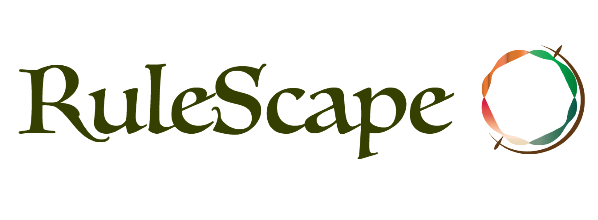
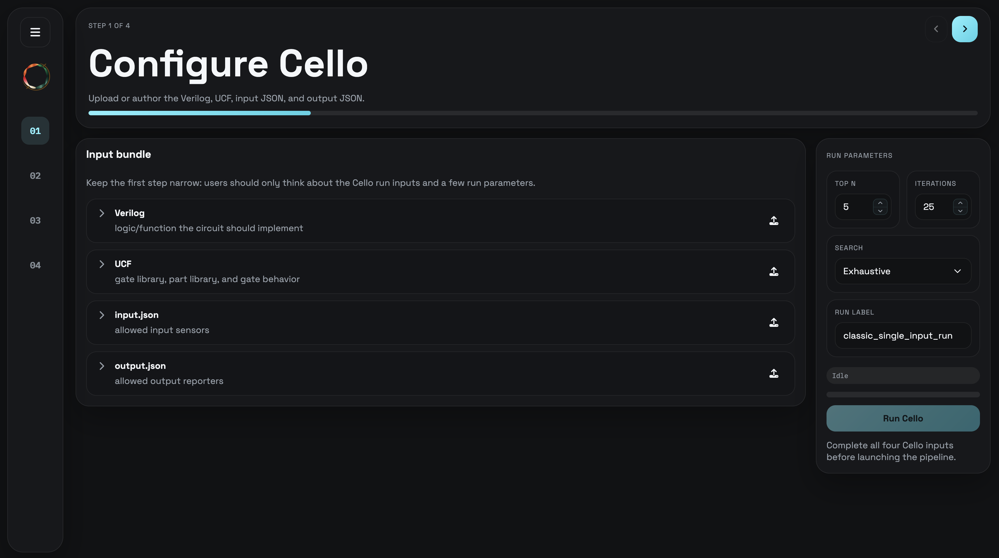

<div align="center">
   
</div> 
<div align="center">

      

</div>

___

RuleScape is a comprehensive integration pipeline for Knox and Cello that helps manage combinitorial explosion through rule rankings, powered by various machine learning algorithms


## <strong>Rank-based Approach to Design</strong>
RuleScape's Rule-Ranking system is what sets it apart from other design workflows. Through RuleScape's host of Machine Learning models trained on genetic designs and their rules, designs are ranked and high-throughput rules are put center stage to help guide designs. 

## <strong>Seamless UI</strong>

<div align="center">
  
</div>

RuleScape aims to streamline circuit design by integrating Knox and Cello and centralizing commands and controls for the design process in one place. 

Through the modernized UI, RuleScape guides users through design consideration decisions and allows for custom libraries. 

## <strong>Under the Hood</strong>

RuleScape's adapter layer drives the integration of Knox and Cello, allowing the two to communicate quickly and effectively and removing the friction between design development and expression modeling

## What's here

- `knox/` - Git submodule for storing, querying, and visualizing genetic design spaces.
- `cello/` - Git submodule for compiling logic designs into genetic circuit implementations.
- `dataio/` - Local scripts and datasets for preparing inputs, generating UCF files, and supporting analysis.

## <strong> Installation </strong>

This repo depends on Git submodules for the main application code. Clone it with:

```bash
git clone --recurse-submodules https://github.com/julsjac/RuleScape.git
cd RuleScape/pipeline-ui-app
./scripts/install_frontend.sh
```

Before running the front end, ensure `graphviz` and `yosys` are installed on your system for compatibility with Cello

### Linux/WSL
```bash
sudo apt install graphviz yosys
```

### Mac
```bash
brew install graphviz yosys
```

## Launch apps
Each of these services must be launched in their own terminal.

To launch the frontend, run:
```bash
cd RuleScape/pipeline-ui-app
npm run dev
```

Then, to launch Cello:
```bash
cd RuleScape/cello
python cello_knox/pipeline_server.py
```
Then open: `http://127.0.0.1:5173`


To launch Knox:
```bash
cd RuleScape/knox
docker-compose up --build
```

---

To use a simple example, examples files are located at:
- `RuleScape/examples/cello_input` - These are for the first stage, contains a .v, UCF, input/output.json
- `RuleScape/examples/knox_input` - This folder contains a simple goldbar rule, and a mapping layer (categories.json)
